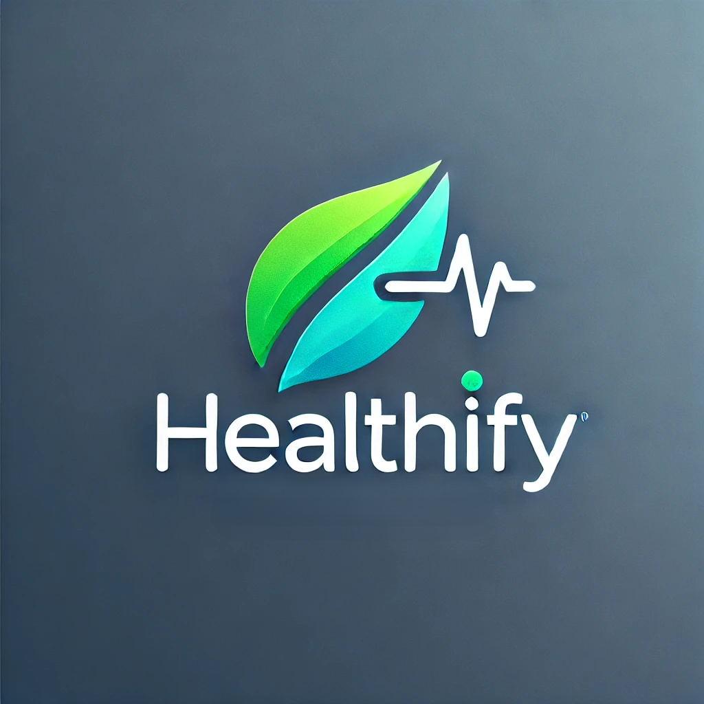
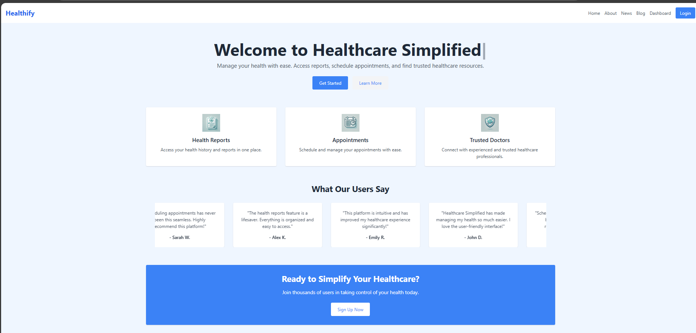

<a id="readme-top"></a>
[![Contributors][contributors-shield]][contributors-url]
[![Forks][forks-shield]][forks-url]
[![Stargazers][stars-shield]][stars-url]
[![Issues][issues-shield]][issues-url]
[![MIT License][license-shield]][license-url]

<!-- PROJECT LOGO -->
<br />
<div align="center">
  <a href="https://github.com/SathishAdithiyaaSV/Healthify">
    
  </a>

<h3 align="center">Healthify</h3>

  <p align="center">
  Health Project is a modern web application designed to provide an efficient and user-friendly platform for healthcare management. With features such as location-based hospital mapping, dynamic health blogs, and an integrated chatbot, this platform caters to both patients and healthcare professionals.
    <br />
    <a href="https://github.com/SathishAdithiyaaSV/Healthify"><strong>Explore the docs »</strong></a>
    <br />
    <br />
    <!-- <a href="https://github.com/github_username/repo_name">View Demo</a> -->
  </p>
</div>


<!-- TABLE OF CONTENTS -->
<details>
  <summary>Table of Contents</summary>
  <ol>
    <li>
      <a href="#about-the-project">About The Project</a>
      <ul>
        <li><a href="#built-with">Built With</a></li>
      </ul>
    </li>
    <li>
      <a href="#getting-started">Getting Started</a>
      <ul>
        <li><a href="#prerequisites">Prerequisites</a></li>
        <li><a href="#installation">Installation</a></li>
      </ul>
    </li>
    <li><a href="#usage">Usage</a></li>
    <li><a href="#contributing">Contributing</a></li>
    <li><a href="#license">License</a></li>
  </ol>
</details>


<!-- ABOUT THE PROJECT -->
## About The Project



Youtube video link: https://youtu.be/tAv_XemAhVA


This healthcare platform is a modern, scalable web application designed to provide users with an engaging and personalized healthcare management experience. The platform is built using a full-stack architecture with the latest technologies to ensure a responsive, high-performance user interface and robust backend functionality.

At its core, the platform combines React.js for dynamic frontend development, Node.js and Express.js for building fast, scalable server-side APIs, and MongoDB for a flexible and efficient database solution. It also leverages the OpenStreetMap API for geolocation-based features, enhancing user accessibility and convenience.

### Key Features:
- **Dynamic Landing Page**:Displays a map of nearby hospitals using device location, powered by OpenStreetMap API.
- **Dynamic Blogs**: Health blogs are generated dynamically to provide up-to-date and relevant health information.
- **Chatbot Integration**: Users can interact with a chatbot to discuss health-related issues.

- **User Dashboards**:
    * **Patient Dashboard**: View appointments, profiles, and reports.
    * **Doctor Dashboard**: Manage appointments and patient records. 
    * **Admin Dashboard**: Oversee platform operations and user managemen
- **Secure Login and Registration**: Separate registration for patients and doctors.
- **Appointment Scheduling**: Users can schedule appointments seamlessly.
- **Real-Time Data Synchronization**: Leveraging **MongoDB** for real-time updates on patients reports and patient-doctor interactions.

### Technology Stack:
- **Frontend**: 
  - **React.js**: Dynamic and responsive user interface.
  - **TailWinD CSS**: simplifies styling and custom designs, making the interface visually appealing and easy to maintain.
- **Backend**:
  - **Node.js**: A JavaScript runtime that powers the backend, enabling asynchronous, non-blocking I/O for high scalability.
  - **Express.js**: A minimalist web framework for Node.js, providing robust tools for creating RESTful APIs and handling HTTP requests efficiently.
  
- **Database**: 
  - **MongoDB**: A NoSQL database that allows for flexible, schema-less data storage, ideal for storing user profiles, progress data, and course content.
- **API**:  
    * **OpenStreetMap API**: Used to display nearby hospitals based on user location, utilizing device geolocation.  
    * **Gemini API**: Powers the chatbot functionality, providing intelligent responses to user health-related queries.  
    * **NewsAPI**: Fetches the latest health-related news articles dynamically for the blog section.  
    * **MongoDB Atlas API**: Serves as the backend database for storing user data, appointments, and reports securely.  
    * **Browser Geolocation API**: Retrieves the user's current location to enable personalized map views and proximity-based hospital listings.  
    * **Custom REST APIs**: Built with Node.js and Express.js for managing user authentication, profile management, appointment scheduling, and report generation.  


### Workflow & Interaction:

1. **Sign-In/Sign-Up**: Users can sign up and log in via secure authentication. Once logged in, their data, including appointments, profiles, and health records, is securely persisted across sessions.

2. **Dynamic Map on Landing Page**: Upon logging in, users are greeted with a dynamic map powered by the OpenStreetMap API, which displays nearby hospitals and healthcare facilities based on their device's location.

3. **Dynamic Health Blogs**: Users can access dynamically generated health blogs that provide insights into various medical topics and health tips. The content is updated regularly to keep users informed.

4. **Integrated Chatbot Assistance**: The platform includes a chatbot designed to assist users with health-related queries in real time, offering a personalized and interactive experience.

5. **User Role-Based Dashboards**:

    * Patients:

      * Schedule and manage appointments easily through a user-friendly interface.

      * View and download health reports directly from their dashboard.

      * Update and maintain their personal profile details.

    * Doctors:

      * Manage and track appointments efficiently.

      * Access and review patient details and reports.

      * Communicate with patients via integrated tools.

    * Admins:

      * Oversee platform operations, including user and content management.

      * Monitor overall activity and ensure smooth functioning of the system.

      * Schedule Appointments: The platform offers a seamless appointment scheduling system where users can book appointments with doctors based on availability.

7. **Real-Time Data Updates**: All changes made by users (appointments, reports, or profile updates) are instantly synchronized with the backend to provide a consistent and updated user experience.

This platform combines a powerful backend with an interactive front-end to create a scalable, robust, and user-friendly healthcare solution. It has been designed to support the growing needs of patients, healthcare professionals, and administrators, ensuring a seamless experience for all.


<p align="right">(<a href="#readme-top">back to top</a>)</p>


### Built With
* [![React][React.js]][React-url]
<!-- Tailwind CSS Badge -->
* [![TailwindCSS][Tailwind]][tailwind-url]

<!-- Node.js Badge -->
* [![Node.js][Nodejs]][Nodejs-url]

<!-- Express.js Badge -->
* [![Express.js][Express.js]][express-url]

<!-- MongoDB Badge -->
* [![MongoDB][]][mongodb-url]


<p align="right">(<a href="#readme-top">back to top</a>)</p>


<!-- GETTING STARTED -->
## Getting Started

This is an example of how you may give instructions on setting up your project locally.
To get a local copy up and running follow these simple example steps.

### Prerequisites

Make sure you have the latest version of npm installed
* npm
  ```sh
  npm install npm@latest -g
  ```
* Install MongoDB : https://www.mongodb.com/docs/manual/installation/

### Getting all the requried API Keys for your project:
To run this project, you need to create .env files in both the frontend and backend directories and include the respective API keys. Below are the steps to obtain the required API keys and configure them properly.

1. #### **Setting up the environment file in frontend**:
 ```
 touch .env
 ```
Inside `.env` add the following variables
```
VITE_GEMINI_API_KEY=your_gemini_api_key_here
VITE_NEWS_API_KEY=your_news_api_key_here
```
Steps to obtain the API keys:

1. Gemini API key:
   * Visit <a href="googlestudio.com">Google AI studio</a> 
   * Sign up or log in to create a new API key.
   * Copy the API key and replace `your_gemini_api_key_here` with the key.

2. News API Key:
    * Go to the <a href="https://newsapi.org/">NewsAPI website</a>
    * Sign up or log in to your account.
    * Navigate to the API Key section and generate a key.
    * Replace  `your_news_api_key_here` with the generated API key.

2. #### Setting Up the Environment File in Backend
In the backend directory, create a `.env` file:
```
touch .env
```
Inside `.env`, add the following variable:

```
MONGO_URI=your_mongodb_connection_uri_here
```
**Steps to Obtain the MongoDB Connection URI**

1. Create a MongoDB Atlas Account:

    * Go to the MongoDB Atlas website.
    * Sign up or log in to your account.
2. Create a Cluster:

    * Follow the instructions to create a new cluster.
3. Connect to the Cluster:

    * Under the Connect option, select Connect Your Application.
    * Copy the connection string and replace    `your_mongodb_connection_uri_here` in the `.env` file.
### Installation

1. Clone the repo
   ```sh
   git clone https://github.com/SathishAdithiyaaSV/Healthify
   ```
2. Install NPM packages
   ```sh
   npm install
   ```

3. Start the backend server
   ```sh
   cd backend
   node server.js
   ```
4. Start the frontend
   ```sh
   cd frontend
   npm run dev
   ```

## Routes 

* `/news`: Displays the health blog section.
* `/blog`: Dynamic blog section for health-related posts.
* `/hero`: Hero component of the landing page.
* `/about`: Information about the platform.
* `/login`: User login page.
* `/patient-dashboard`: Dashboard for patients to view appointments, profiles, and reports.
* `/profile`: Profile management for users.
* `/doctor-dashboard`: Dashboard for doctors to manage appointments and patients.
* `/admin-dashboard`: Dashboard for administrators to oversee the platform.
* `/schedule-appointment`: Appointment form for detailed scheduling.
* `/register-patient`: Registration page for new patients.
* `/register-doctor`: Registration page for new doctors.
* `/reports`: Page to access and view health reports.

<!-- USAGE EXAMPLES -->
## Usage

### Landing Page
The landing page features a dynamic map displaying nearby hospitals, utilizing device location through the OpenStreetMap API. This provides users with quick access to nearby healthcare facilities.

1. #### Blog and Chatbot

* Blogs: Health blogs are dynamically generated, offering insights and updates on various health topics.

* Chatbot: Integrated chatbot assists users in resolving health-related queries in real time.

2. #### User Interaction

* Patients: View and manage appointments, access reports, and update profiles.

* Doctors: Manage patient appointments and access relevant patient information.

* Admins: Oversee platform operations, including user management and content updates.
  


<!-- _For more examples, please refer to the [Documentation](https://example.com)_ -->

<p align="right">(<a href="#readme-top">back to top</a>)</p>

<!-- CONTRIBUTING -->
## Contributing

Contributions are what make the open source community such an amazing place to learn, inspire, and create. Any contributions you make are **greatly appreciated**.

If you have a suggestion that would make this better, please fork the repo and create a pull request. You can also simply open an issue with the tag "enhancement".
Don't forget to give the project a star! Thanks again!

1. Fork the Project
2. Create your Feature Branch (`git checkout -b feature/AmazingFeature`)
3. Commit your Changes (`git commit -m 'Add some AmazingFeature'`)
4. Push to the Branch (`git push origin feature/AmazingFeature`)
5. Open a Pull Request

<p align="right">(<a href="#readme-top">back to top</a>)</p>

### Top contributors:

<a href="https://github.com/SathishAdithiyaaSV/lingo-land/graphs/contributors">
  
</a>


<!-- LICENSE -->
## License
Distributed under the MIT License. See `LICENSE.txt` for more information.

<p align="right">(<a href="#readme-top">back to top</a>)</p>


<!-- MARKDOWN LINKS & IMAGES -->
<!-- https://www.markdownguide.org/basic-syntax/#reference-style-links -->
[contributors-shield]: https://img.shields.io/github/contributors/SathishAdithiyaaSV/lingo-land?style=for-the-badge
[contributors-url]: https://github.com/SathishAdithiyaaSV/lingo-land/graphs/contributors
[forks-shield]: https://img.shields.io/github/forks/SathishAdithiyaaSV/lingo-land.svg?style=for-the-badge
[forks-url]: https://github.com/SathishAdithiyaaSV/lingo-land/network/members
[stars-shield]: https://img.shields.io/github/stars/SathishAdithiyaaSV/lingo-land.svg?style=for-the-badge
[stars-url]: https://github.com/SathishAdithiyaaSV/lingo-land/stargazers
[issues-shield]: https://img.shields.io/github/issues/SathishAdithiyaaSV/lingo-land.svg?style=for-the-badge
[issues-url]: https://github.com/SathishAdithiyaaSV/lingo-land/issues
[license-shield]: https://img.shields.io/github/license/SathishAdithiyaaSV/lingo-land.svg?style=for-the-badge
[license-url]: https://github.com//SathishAdithiyaaSV/blob/master/LICENSE.txt
[linkedin-shield]: https://img.shields.io/badge/-LinkedIn-black.svg?style=for-the-badge&logo=linkedin&colorB=555
[linkedin-url]: https://linkedin.com/in/linkedin_username
[product-screenshot]: images/screenshot.png
[Next.js]: https://img.shields.io/badge/next.js-000000?style=for-the-badge&logo=nextdotjs&logoColor=white
[Next-url]: https://nextjs.org/
[React.js]: https://img.shields.io/badge/React-20232A?style=for-the-badge&logo=react&logoColor=61DAFB
[React-url]: https://reactjs.org/
[Tailwind]: https://img.shields.io/badge/Tailwind_CSS-38B2AC?style=for-the-badge&logo=tailwind-css&logoColor=white
[Tailwind-url]: https://tailwindcss.com/
[Nodejs]: https://img.shields.io/badge/Node.js-5FA04E?logo=nodedotjs&logoColor=fff&style=for-the-badge
[Nodejs-url]: https://nodejs.org/en
[Express.js]: https://img.shields.io/badge/Express.js-404D59?style=for-the-badge
[Express-url]: https://expressjs.com/
[Socket.io]: https://img.shields.io/badge/Socket.io-010101?logo=socketdotio&logoColor=fff&style=for-the-badge
[Socket-url]: https://socket.io/
[MongoDB]: https://img.shields.io/badge/MongoDB-4EA94B?style=for-the-badge&logo=mongodb&logoColor=white
[MongoDB-url]: https://www.mongodb.com/
[Vue.js]: https://img.shields.io/badge/Vue.js-35495E?style=for-the-badge&logo=vuedotjs&logoColor=4FC08D
[Vue-url]: https://vuejs.org/
[Angular.io]: https://img.shields.io/badge/Angular-DD0031?style=for-the-badge&logo=angular&logoColor=white
[Angular-url]: https://angular.io/
[Svelte.dev]: https://img.shields.io/badge/Svelte-4A4A55?style=for-the-badge&logo=svelte&logoColor=FF3E00
[Svelte-url]: https://svelte.dev/
[Laravel.com]: https://img.shields.io/badge/Laravel-FF2D20?style=for-the-badge&logo=laravel&logoColor=white
[Laravel-url]: https://laravel.com
[Bootstrap.com]: https://img.shields.io/badge/Bootstrap-563D7C?style=for-the-badge&logo=bootstrap&logoColor=white
[Bootstrap-url]: https://getbootstrap.com
[JQuery.com]: https://img.shields.io/badge/jQuery-0769AD?style=for-the-badge&logo=jquery&logoColor=white
[JQuery-url]: https://jquery.com 
